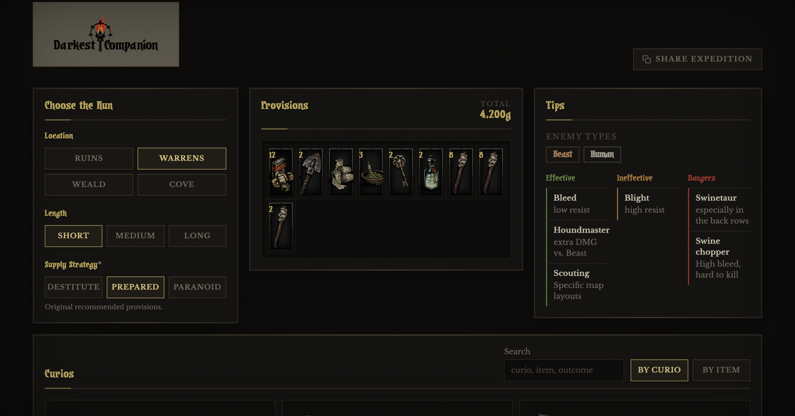
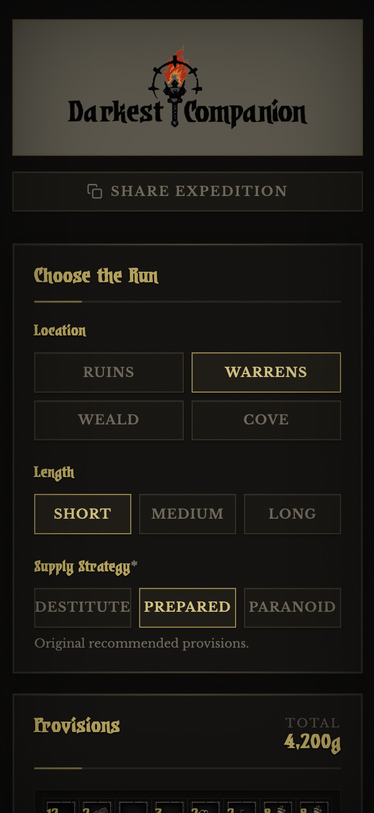

# Darkest Companion

A concise Darkest Dungeon companion for planning expeditions: provisions, curios, location tips, and shareable run state.

| Desktop | Mobile |
| --- | --- |
|  |  |

## Features

- Provision recommendations by location, dungeon length, and supply strategy.
- Curio lookup by curio or by item, with searchable outcomes.
- Location tips for enemy types, effective supplies, weak picks, and hazards.
- Shareable URLs that preserve the selected run setup and filters.

## Stack

- SvelteKit 2
- Svelte 5
- Vite
- Tailwind CSS 4
- Vitest

## Requirements

- Node.js 24, matching the GitHub Pages workflow.
- npm

## Development

```bash
npm install
npm run dev
```

## Scripts

- `npm run dev` starts the local dev server.
- `npm run check` runs Svelte and TypeScript checks.
- `npm test` runs the Vitest suite.
- `npm run build` creates the static production build.
- `npm run preview` serves the production build locally.

## Deployment

Pushes to `master` build and deploy the static site to GitHub Pages through `.github/workflows/deploy-github-pages.yml`.

## Credits

Game content, images, and materials are trademarks and copyrights of Red Hook Studios, creators of Darkest Dungeon.
